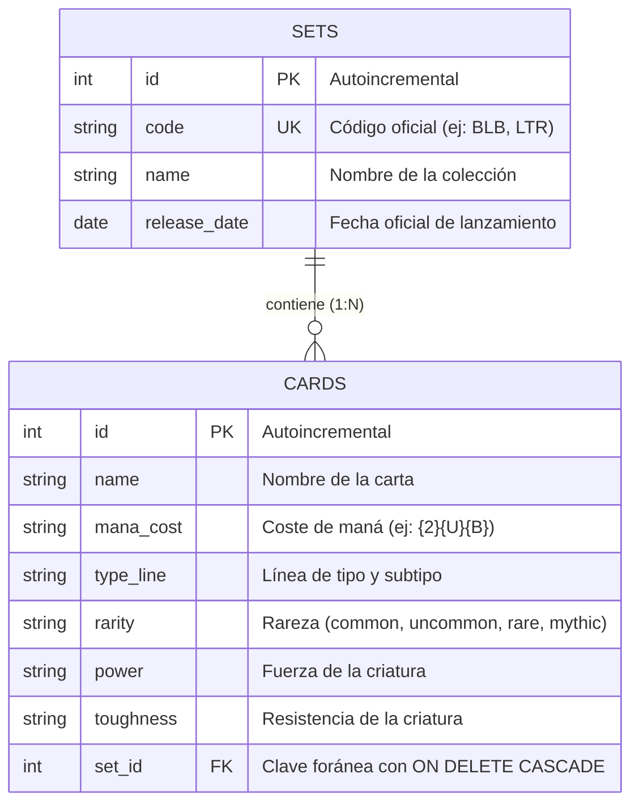

# 🃏 MTG Collection Vault

API REST y panel interactivo para la catalogación y gestión de cartas y colecciones de *Magic: The Gathering*. La aplicación cuenta con una arquitectura desacoplada por capas en FastAPI, persistencia relacional en SQLite con integridad referencial estricta, validación de esquemas con Pydantic v2 e integración asíncrona con la API de Scryfall.

---

## 🛠️ Tecnologías

* **Backend:** Python 3.10+, FastAPI, Pydantic v2, SQLAlchemy ORM.
* **Persistencia:** SQLite con enforcement estricto de claves foráneas (`PRAGMA foreign_keys=ON`).
* **Frontend:** HTML5 semántico, CSS3 modular (variables y diseño responsive), JavaScript Vanilla (ES6+), Axios.
* **APIs Externas:** Scryfall REST API (renderizado dinámico de arte oficial y textos de reglas Oracle).
* **Herramientas de desarrollo:** Git, Uvicorn, Dotenv.

---

## 📐 Diagrama Entidad-Relación (DER)

La persistencia modela una relación uno a muchos ($1:N$) entre colecciones (`sets`) y cartas (`cards`), asegurando que la eliminación de un set propague un borrado en cascada sobre todas sus cartas asociadas:



---

## ⚙️ Guía de Instalación Local

### 1. Clonar el repositorio
```bash
git clone <URL_DEL_REPOSITORIO>
cd mtg-api
```

### 2. Configuración del entorno virtual
En Windows (PowerShell):
```powershell
python -m venv .venv
.venv\Scripts\Activate.ps1
pip install -r requirements.txt
```

En Linux / macOS:
```bash
python3 -m venv .venv
source .venv/bin/activate
pip install -r requirements.txt
```

### 3. Configuración del entorno (`.env`)
Crea un archivo `.env` en la raíz del proyecto basándote en la siguiente plantilla:
```env
APP_TITLE="MTG Collection API"
APP_VERSION="1.0.0"
APP_DESCRIPTION="API REST para colecciones y cartas de Magic: The Gathering"
DATABASE_URL="sqlite:///./mtg.db"
```

### 4. Ejecución del servidor
Inicia el backend con recarga automática:
```bash
uvicorn backend.app.main:app --reload
```
* **API y Swagger UI:** Accede a la documentación interactiva en `http://127.0.0.1:8000/docs`.
* **Frontend:** Abre `frontend/index.html` en el navegador o mediante la extensión *Live Server* de Visual Studio Code.

---

## 🔌 Documentación de Endpoints

### Colecciones (`/sets`)
| Método | Ruta | Estado | Descripción |
| :--- | :--- | :--- | :--- |
| `GET` | `/sets/` | `200 OK` | Listar colecciones con paginación (`skip`, `limit`) |
| `GET` | `/sets/{id}` | `200 OK` | Obtener detalle de una colección por su ID |
| `POST` | `/sets/` | `201 Created` | Registrar nueva colección (código único) |
| `PUT` | `/sets/{id}` | `200 OK` | Modificar datos de una colección existente |
| `DELETE` | `/sets/{id}` | `204 No Content` | Borrado en cascada del set y sus cartas asociadas |

### Cartas (`/cards`)
| Método | Ruta | Estado | Descripción |
| :--- | :--- | :--- | :--- |
| `GET` | `/cards/` | `200 OK` | Listar cartas (soporta filtros `name`, `set_id`, `skip`, `limit`) |
| `GET` | `/cards/{id}` | `200 OK` | Obtener detalle de una carta por su ID |
| `POST` | `/cards/` | `201 Created` | Crear carta vinculada a un set existente |
| `PUT` | `/cards/{id}` | `200 OK` | Actualizar atributos de una carta |
| `DELETE` | `/cards/{id}` | `204 No Content` | Eliminar una carta específica |

---

## 💡 Ejemplos de Petición y Respuesta

### 1. Registrar una nueva colección
**Petición:** `POST /sets/`
```json
{
  "code": "BLB",
  "name": "Bloomburrow",
  "release_date": "2024-08-02"
}
```
**Respuesta:** `201 Created`
```json
{
  "id": 1,
  "code": "BLB",
  "name": "Bloomburrow",
  "release_date": "2024-08-02"
}
```

### 2. Registrar una nueva carta
**Petición:** `POST /cards/`
```json
{
  "name": "Marrow-Gnawer",
  "mana_cost": "{3}{B}{B}",
  "type_line": "Legendary Creature — Rat Rogue",
  "rarity": "rare",
  "power": "2",
  "toughness": "3",
  "set_id": 1
}
```
**Respuesta:** `201 Created`
```json
{
  "id": 1,
  "name": "Marrow-Gnawer",
  "mana_cost": "{3}{B}{B}",
  "type_line": "Legendary Creature — Rat Rogue",
  "rarity": "rare",
  "power": "2",
  "toughness": "3",
  "set_id": 1,
  "set": {
    "id": 1,
    "code": "BLB",
    "name": "Bloomburrow",
    "release_date": "2024-08-02"
  }
}
```

### 3. Consultar cartas con filtro por nombre
**Petición:** `GET /cards/?name=Marrow`
**Respuesta:** `200 OK`
```json
[
  {
    "id": 1,
    "name": "Marrow-Gnawer",
    "mana_cost": "{3}{B}{B}",
    "type_line": "Legendary Creature — Rat Rogue",
    "rarity": "rare",
    "power": "2",
    "toughness": "3",
    "set_id": 1,
    "set": {
      "id": 1,
      "code": "BLB",
      "name": "Bloomburrow",
      "release_date": "2024-08-02"
    }
  }
]
```